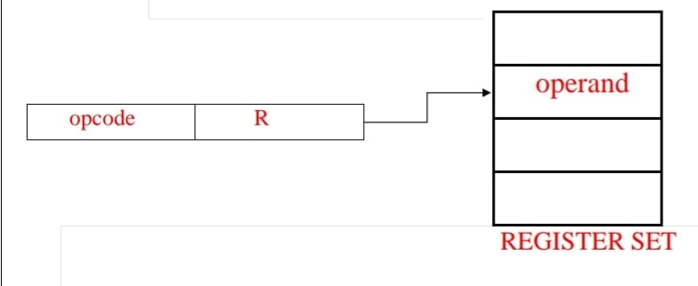
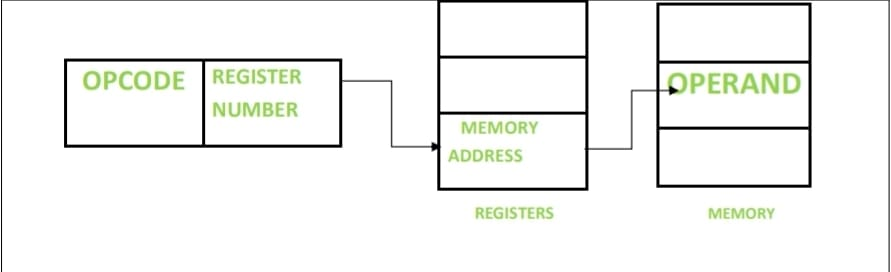

# ADDRESSING MODES

- Programs are normally written in a high-level language, which enables the programmer to conveniently describe the operations to be performed on various data structures.
- When translating a high-level language program into assembly language, the compiler generates appropriate sequences of low-level instructions that implement the desired operations.
- The different ways for specifying the locations of instruction operands are known as addressing modes.
- Addressing modes in computer architecture define how a microprocessor accesses data or operands in memory.
- They are essential for efficient programming and memory management.
- Common addressing modes include Immediate, Register, Direct, Indirect, Indexed, Relative, Base-Register, and Stack Pointer Relative modes.
- Addressing modes in computer organization refer to the methods by which the CPU accesses operands (data or instructions) in memory or registers during program execution.

**RISC-Type Addressing Modes:**
- Immediate
- Register
- Absolute
- Register Indirect
- Index and Base with Index

**RISC-type addressing modes:**

| Name                | Assembler syntax | Addressing function |
|---------------------|-------------------|---------------------|
| Immediate           | #value            | Operand = value     |
| Register            | Ri                | EA = Ri             |
| Absolute            | LOC               | EA = LOC            |
| Register indirect   | (Ri)              | EA = [Ri]           |
| Index               | X(Ri)             | EA = [Ri] + X       |
| Base with index     | (Ri,Rj)           | EA = [Ri] + [Rj]    |

- Assembler syntax is provided for each mode, defining how instructions and operand addressing modes are specified.
- EA refers to the location in memory that is being accessed or operated upon by the instruction.
- X represents an index value used in certain addressing modes to calculate the effective address.

**IMPLEMENTATION OF VARIABLES AND CONSTANTS**

- Implementation of variables and constants involves allocating memory space for storage and defining rules for accessing and modifying their values. The programming language's compiler or interpreter handles the allocation and management of memory for variables and constants.
- Variables may be stored in different memory locations based on their data type and scope, while constants are typically stored in read-only memory (ROM) or as literals in the program's code.
- The precise definitions of these two modes are:
  - Register mode—The operand is the contents of a processor register; the name of the register is given in the instruction.
  - Absolute mode—The operand is in a memory location; the address of this location is given explicitly in the instruction.
- Since in a RISC-style processor an instruction must fit in a single word, the number of bits that can be used to give an absolute address is limited, typically to 16 bits if the word length is 32 bits.

**RISC-TYPE ADDRESSING MODES:**

**IMMEDIATE ADDRESSING MODE:**

1. Operand values are directly specified within the instruction.
2. Example: `ADDI R1, R2, #10` (Add the immediate value 10 to the contents of register R2 and store the result in register R1)

**REGISTER DIRECT ADDRESSING MODE:**

1. Operands are accessed directly from registers.
2. Example: `ADD R1, R2, R3` (Add the contents of registers R2 and R3 and store the result in register R1).

**REGISTER INDIRECT ADDRESSING MODES:**

1. Operand addresses are stored in registers, and the contents of those addresses are accessed.
2. Example: `LW R1, 0(R2)` (Load the word from the memory address stored in register R2 and store it in register R1).

**BASE-INDEXED ADDRESSING MODE:**

1. Addresses are formed by adding an offset to a base register.
2. Example: `LW R1, 100(R2)` (Load the word from the memory address calculated by adding 100 to the contents of register R2 and store it in register R1).

**PC-RELATIVE INDEXED ADDRESSING:**

1. Addresses are calculated relative to the program counter (PC).
2. Example: `BEQ R1, R2, Label` (Branch to the instruction labeled "Label" if the contents of registers R1 and R2 are equal).

**REAL WORLD APPLICATIONS:**

**EMBEDDED SYSTEMS:**

In embedded systems, addressing modes are used extensively due to their limited memory and processing power. Efficient use of addressing modes helps optimize code size and execution speed.
Example: Microcontrollers used in automotive applications employ addressing modes to efficiently control engine timing, manage sensors, and perform real-time data processing.

**Operating Systems:**

Operating systems use addressing modes for memory management, process scheduling, and resource allocation.
Example: Addressing modes are utilized in virtual memory systems to map logical addresses to physical addresses efficiently, allowing for multitasking and memory protection in modern operating systems like Windows, Linux, and macOS.

**Compilers and Interpreters:**

Compilers and interpreters translate high-level programming languages into machine code, utilizing addressing modes to optimize generated code and improve performance.
Example: Addressing modes are crucial in optimizing generated assembly code for various architectures in compilers like GCC (GNU Compiler Collection) and LLVM (Low Level Virtual Machine).

**Networking and Telecommunications:**

Addressing modes are used in networking equipment and protocols for data routing, packet forwarding, and addressing devices on a network.
Example: Internet Protocol (IP) addresses and MAC addresses in networking protocols like TCP/IP rely on addressing modes for routing data packets efficiently across networks.

**Digital Signal Processing (DSP):**

DSP applications utilize addressing modes to efficiently process and manipulate digital signals in real-time.
Example: Digital audio processors and image processing systems employ addressing modes to access and manipulate large datasets efficiently for tasks like audio filtering, compression, and image enhancement.

**Scientific and Engineering Simulations:**

Addressing modes are used in scientific computing and engineering simulations for numerical calculations and data manipulation.
Example: Computational fluid dynamics (CFD) simulations utilize addressing modes to access and process large arrays of data representing fluid flow velocities, pressures, and temperatures in real-world systems like aircraft and automobiles.

**RECENT TRENDS:**

1. **Specialized Processors and Accelerators:**
   - With the rise of specialized processors and accelerators for specific tasks like machine learning (ML) and artificial intelligence (AI), addressing modes may be optimized to cater to the unique requirements of these workloads. Addressing modes tailored for efficient data movement and manipulation could be a focus in such architectures.
   
2. **Vectorization and SIMD (Single Instruction, Multiple Data):**
   - Vectorization and SIMD instructions are increasingly important for performance optimization in tasks involving parallel processing, such as multimedia applications, scientific computing, and gaming. Addressing modes that facilitate efficient access to vectorized data structures and memory layouts may see further development to enhance performance in these areas.
   
3. **Security and Memory Protection:**
   - With growing concerns about cybersecurity, addressing modes may evolve to incorporate enhanced security features such as hardware-based memory protection and address space layout randomization (ASLR). These advancements aim to mitigate vulnerabilities related to memory access and protect against various cyber threats.
   
4. **Quantum Computing:**
   - In the realm of quantum computing, addressing modes may undergo significant changes to accommodate the unique principles of quantum information processing. Address
